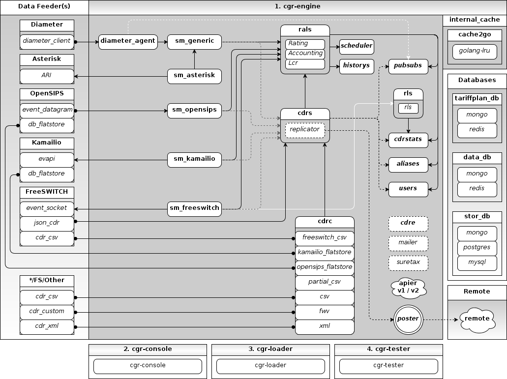

2. Architecture
===============
The CGRateS suite consists of **four** software applications described below.

.. hlist::
   :columns: 4

   - cgr-engine
   - cgr-loader  
   - cgr-console
   - cgr-tester

CGRateS has an internal cache.

::

   "internal_cache" - cache2go

Operates with different external databases mentioned below. 

::

   "tariffplan_db" - MongoDB, Redis
   "data_db"       - MongoDB, Redis
   "stor_db"       - MongoDB, MySQL, PostgreSQL

.. hlist::
   :columns: 1

   - **tariffplan_db** - used to store active tariff plan(s) configuration(s)
   - **data_db**       - used to store runtime data ( eg: accounts )
   - **stor_db**       - used to store offline tariff plan(s) and CDRs

   
   
   CGRateS high level design

2.1. cgr-engine
---------------
Is the most important and complex component. 
Customisable through the use of *json* configuration file(s), 
it will start on demand **one or more** service(s), outlined below.

::

 rif@grace:~$ cgr-engine -help
 Usage of cgr-engine:
   -cdrs
         Enforce starting of the cdrs daemon overwriting config
   -config_dir string
         Configuration directory path. (default "/etc/cgrates/")
   -cpuprofile string
         write cpu profile to file
   -pid string
         Write pid file
   -rater
         Enforce starting of the rater daemon overwriting config
   -scheduler
         Enforce starting of the scheduler daemon .overwriting config
   -singlecpu
         Run on single CPU core
   -version
         Prints the application version.

.. hint::  # cgr-engine -config_dir=/etc/cgrates

2.1.1. Balancer service
~~~~~~~~~~~~~~~~~~~~~~~
*Optional* component, used as proxy/balancer to a pool of RAL workers. 
The RALs will register their availability to the Balancer thus implementing **dynamic HA functionality**.
**HA functionality** can be archived also *without* the **Balancer**.

- Communicates via:
   - RPC
   - internal/in-process *within the same running* **cgr-engine** process.

- Operates with the following CGRateS database(s): ::

   - none

- Config section in the CGRateS configuration file:
   - ``"balancer": {...}``

2.1.2. RALs service
~~~~~~~~~~~~~~~~~~~~
Responsible with the following tasks:

   - Operates on balances.
   - Computes prices for rating subjects.
   - Monitors and executes triggers.
   - LCR functionality

- Communicates via:
   - RPC
   - internal/in-process *within the same running* **cgr-engine** process.

- Operates with the following CGRateS database(s): ::

   "tariffplan_db" - (ratingDb)
   "data_db"       - (accountDb)
   "stor_db"       - (cdrDb, loadDb)

- Config section in the CGRateS configuration file:
   - ``"rals": {...}``

2.1.3. Scheduler service
~~~~~~~~~~~~~~~~~~~~~~~~
Used to execute periodic/scheduled tasks.

- Communicates via:
   - internal/in-process *within the same running* **cgr-engine** process.

- Operates with the following CGRateS database(s): ::

   "tariffplan_db" - (ratingDb)

- Config section in the CGRateS configuration file:
   - ``"scheduler": {...}``

2.1.4. SessionManager service
~~~~~~~~~~~~~~~~~~~~~~~~~~~~~
Responsible with call control on the Telecommunication Switch side. Operates in two different modes (per call or globally):

- PREPAID
   - Monitors call start.
   - Checks balance availability for the call.
   - Enforces global timer for a call at call-start.
   - Executes routing commands for the call where that is necessary ( eg call un-park in case of FreeSWITCH).
   - Periodically executes balance debits on call at the beginning of debit interval.
   - Enforce call disconnection on insufficient balance.
   - Refunds the balance taken in advance at the call stop.

- POSTPAID
   - Executes balance debit on call-stop.

All call actions are logged into CGRateS's LogDB.

Right now there are **four** session manager types.
   - sm_freeswitch
   - sm_kamailio
   - sm_opensips
   - **sm_generic**

- Communicates via:
   - RPC
   - internal/in-process *within the same running* **cgr-engine** process.

- Operates with the following CGRateS database(s): ::

   "stor_db" - (cdrDb)

- Config section in the CGRateS configuration file:
   - ``"sm_freeswitch": {...}`` 
   - ``"sm_kamailio": {...}``
   - ``"sm_opensips": {...}``
   - ``"sm_generic": {...}``

2.1.5. DiameterAgent service
~~~~~~~~~~~~~~~~~~~~~~~~~~~~
Responsible for the communication with Diameter server via diameter protocol.
Despite the name it is a flexible **Diameter Server**.

- Communicates via:
   - RPC
   - internal/in-process *within the same running* **cgr-engine** process.

- Operates with the following CGRateS database(s): ::

   - none

- Config section in the CGRateS configuration file:
   - ``"diameter_agent": {...}``

2.1.6. CDRS service
~~~~~~~~~~~~~~~~~~~
Centralized CDR server and CDR (raw or rated) **replicator**.

- Communicates via:
   - RPC
   - internal/in-process *within the same running* **cgr-engine** process.

- Operates with the following CGRateS database(s): ::

   "stor_db" - (cdrDb)

- Config section in the CGRateS configuration file:
   - ``"cdrs": {...}``

2.1.7. CDRStats service
~~~~~~~~~~~~~~~~~~~~~~~
Computes real-time CDR stats. Capable with real-time fraud detection and mitigation with actions triggered.

- Communicates via:
   - RPC
   - internal/in-process *within the same running* **cgr-engine** process.

- Operates with the following CGRateS database(s): ::

   "tariffplan_db" - (ratingDb)
   "data_db"       - (accountDb)

- Config section in the CGRateS configuration file:
   - ``"cdrstats": {...}``

2.1.8. CDRC service
~~~~~~~~~~~~~~~~~~~
Gathers offline CDRs and post them to CDR Server - (CDRS component)

- Communicates via:
   - RPC
   - internal/in-process *within the same running* **cgr-engine** process.

- Operates with the following CGRateS database(s): ::

   - none

- Config section in the CGRateS configuration file:
   - ``"cdrc": {...}``

2.1.9. History service
~~~~~~~~~~~~~~~~~~~~~~
Archives rate changes in human readable JSON format using **GIT**. 

- Communicates via:
   - RPC
   - internal/in-process *within the same running* **cgr-engine** process.

- Operates with the following CGRateS database(s): ::

   - none

- Config section in the CGRateS configuration file:
   - ``"historys": {...}``

2.1.10. Aliases service
~~~~~~~~~~~~~~~~~~~~~~~
Generic purpose **aliasing** system.

Possible applications:
   - Change destination name based on user or destination prefix matched.
   - Change lcr supplier name based on the user calling.
   - Locale specifics, ability to display specific tags in user defined language.

- Communicates via:
   - RPC
   - internal/in-process *within the same running* **cgr-engine** process.

- Operates with the following CGRateS database(s): ::

   "data_db" - (accountDb)

- Config section in the CGRateS configuration file:
   - ``"aliases": {...}``

2.1.11. User service
~~~~~~~~~~~~~~~~~~~~
Generic purpose **user** system to maintain user profiles (LDAP similarity).

- Communicates via:
   - RPC
   - internal/in-process *within the same running* **cgr-engine** process.

- Operates with the following CGRateS database(s): ::
  
   "data_db" - (accountDb)

- Config section in the CGRateS configuration file:
   - ``"users": {...}``

2.1.12. PubSub service
~~~~~~~~~~~~~~~~~~~~~~
PubSub service used to expose internal events to interested external components (eg: balance ops)

- Communicates via:
   - RPC
   - internal/in-process *within the same running* **cgr-engine** process.

- Operates with the following CGRateS database(s): ::

   "data_db" - (accountDb)

- Config section in the CGRateS configuration file:
   - ``"pubsubs": {...}``

2.1.13. Resource Limiter service
~~~~~~~~~~~~~~~~~~~~~~~~~~~~~~~~
Resource Limiter service used to limit resources during authorization (eg: maximum calls per destination for an account)

- Communicates via:
   - RPC
   - internal/in-process *within the same running* **cgr-engine** process.

- Operates with the following CGRateS database(s): ::

   "data_db" - (accountDb)

- Config section in the CGRateS configuration file:
   - ``"rls": {...}``

2.1.14. APIER RPC service
~~~~~~~~~~~~~~~~~~~~~~~~~
RPC service used to expose external access towards internal components.

- Communicates via:
   - JSON/GOB over socket
   - JSON over HTTP
   - JSON over WebSocket

2.1.15. Cdre
~~~~~~~~~~~~
Component to retrieve rated CDRs from internal CDRs database.

- Communicates via:

- Operates with the following CGRateS database(s): ::

   "stor_db" - (cdrDb)

- Config section in the CGRateS configuration file:
   - ``"cdre": {...}``

2.1.16. Mailer
~~~~~~~~~~~~~~
TBD

- Communicates via:

- Operates with the following CGRateS database(s):

- Config section in the CGRateS configuration file:
   - ``"mailer": {...}``

2.1.17. Suretax
~~~~~~~~~~~~~~~
TBD

- Communicates via:

- Operates with the following CGRateS database(s):

- Config section in the CGRateS configuration file:
   - ``"suretax": {...}``

2.1.X Mediator service
~~~~~~~~~~~~~~~~~~~~~~

.. important:: This service is not valid anymore. Its functionality is replaced by CDRC and CDRS services.

Responsible to mediate the CDRs generated by Telecommunication Switch. 

Has the ability to combine CDR fields into rating subject and run multiple mediation processes on the same record.

On Linux machines, able to work with inotify kernel subsystem in order to process the records close to real-time after the Switch has released them.

2.2. cgr-loader
---------------
Used for importing the rating information into the CGRateS database system. 

Can be used to:
   - Import information from **csv files** to **tariffplan_db**, **data_db**.
   - Import information from **csv files** to **stor_db**. ``-to_stordb -tpid``
   - Import information from **stor_db** to **tariffplan_db**, **data_db**. ``-from_stordb -tpid``

::

 rif@grace:~$ cgr-loader -help
 Usage of cgr-loader:
   -cdrstats_address string
         CDRStats service to contact for data reloads, empty to disable automatic data reloads (default "127.0.0.1:2013")
   -datadb_host string
         The DataDb host to connect to. (default "127.0.0.1")
   -datadb_name string
         The name/number of the DataDb to connect to. (default "11")
   -datadb_passwd string
         The DataDb user's password.
   -datadb_port string
         The DataDb port to bind to. (default "6379")
   -datadb_type string
         The type of the DataDb database <redis> (default "redis")
   -datadb_user string
         The DataDb user to sign in as.
   -dbdata_encoding string
         The encoding used to store object data in strings (default "msgpack")
   -dry_run
         When true will not save loaded data to dataDb but just parse it for consistency and errors.
   -flushdb
         Flush the database before importing
   -from_stordb
         Load the tariff plan from storDb to dataDb
   -history_server string
         The history server address:port, empty to disable automaticautomatic  history archiving (default "127.0.0.1:2013")
   -load_history_size int
         Limit the number of records in the load history (default 10)
   -migrate_rc8
         Migrate Accounts, Actions and ActionTriggers to RC8 structures
   -path string
         The path to folder containing the data files (default "./")
   -rater_address string
         Rater service to contact for cache reloads, empty to disable automatic cache reloads (default "127.0.0.1:2013")
   -runid string
         Uniquely identify an import/load, postpended to some automatic fields
   -stats
         Generates statsistics about given data.
   -stordb_host string
         The storDb host to connect to. (default "127.0.0.1")
   -stordb_name string
         The name/number of the storDb to connect to. (default "cgrates")
   -stordb_passwd string
         The storDb user's password. (default "CGRateS.org")
   -stordb_port string
         The storDb port to bind to. (default "3306")
   -stordb_type string
         The type of the storDb database <mysql> (default "mysql")
   -stordb_user string
         The storDb user to sign in as. (default "cgrates")
   -timezone string
         Timezone for timestamps where not specified <""|UTC|Local|$IANA_TZ_DB> (default "Local")
   -to_stordb
         Import the tariff plan from files to storDb
   -tpdb_host string
         The TariffPlan host to connect to. (default "127.0.0.1")
   -tpdb_name string
         The name/number of the TariffPlan to connect to. (default "10")
   -tpdb_passwd string
         The TariffPlan user's password.
   -tpdb_port string
         The TariffPlan port to bind to. (default "6379")
   -tpdb_type string
         The type of the TariffPlan database <redis> (default "redis")
   -tpdb_user string
         The TariffPlan user to sign in as.
   -tpid string
         The tariff plan id from the database
   -users_address string
         Users service to contact for data reloads, empty to disable automatic data reloads (default "127.0.0.1:2013")
   -validate
         When true will run various check on the loaded data to check for structural errors
   -verbose
         Enable detailed verbose logging output
   -version
         Prints the application version.

.. hint:: # cgr-loader -flushdb
.. hint:: # cgr-loader -verbose -tpdb_port="27017" -tpdb_type="mongo" -datadb_port="27017" -datadb_type="mongo"

2.3. cgr-console
----------------
Command line tool used to interface with the RALs (and/or Balancer) service. Able to execute **sub-commands**. 

::

 rif@grace:~$ cgr-console -help
 Usage of cgr-console:
   -rpc_encoding string
         RPC encoding used <gob|json> (default "json")
   -server string
         server address host:port (default "127.0.0.1:2012")
   -verbose
         Show extra info about command execution.
   -version
         Prints the application version.

 rif@grace:~$ cgr-console help_more
 2013/04/13 17:23:51 
 Usage: cgr-console [cfg_opts...{-h}] <status|get_balance>

.. hint:: # cgr-console status

2.4. cgr-tester
---------------
Command line stress testing tool.

::

 rif@grace:~$ cgr-tester --help
 Usage of cgr-tester:
  -accountdb_host string
        The AccountingDb host to connect to. (default "127.0.0.1")
  -accountdb_name string
        The name/number of the AccountingDb to connect to. (default "11")
  -accountdb_passwd string
        The AccountingDb user's password.
  -accountdb_port string
        The AccountingDb port to bind to. (default "6379")
  -accountdb_type string
        The type of the AccountingDb database <redis> (default "redis")
  -accountdb_user string
        The AccountingDb user to sign in as.
  -category string
        The Record category to test. (default "call")
  -cpuprofile string
        write cpu profile to file
  -dbdata_encoding string
        The encoding used to store object data in strings. (default "msgpack")
  -destination string
        The destination to use in queries. (default "1002")
  -json
        Use JSON RPC
  -memprofile string
        write memory profile to this file
  -parallel int
        run n requests in parallel
  -rater_address string
        Rater address for remote tests. Empty for internal rater.
  -ratingdb_host string
        The RatingDb host to connect to. (default "127.0.0.1")
  -ratingdb_name string
        The name/number of the RatingDb to connect to. (default "10")
  -ratingdb_passwd string
        The RatingDb user's password.
  -ratingdb_port string
        The RatingDb port to bind to. (default "6379")
  -ratingdb_type string
        The type of the RatingDb database <redis> (default "redis")
  -ratingdb_user string
        The RatingDb user to sign in as.
  -runs int
        stress cycle number (default 10000)
  -subject string
        The rating subject to use in queries. (default "1001")
  -tenant string
        The type of record to use in queries. (default "cgrates.org")
  -tor string
        The type of record to use in queries. (default "*voice")

.. hint:: # cgr-tester -runs=10000

