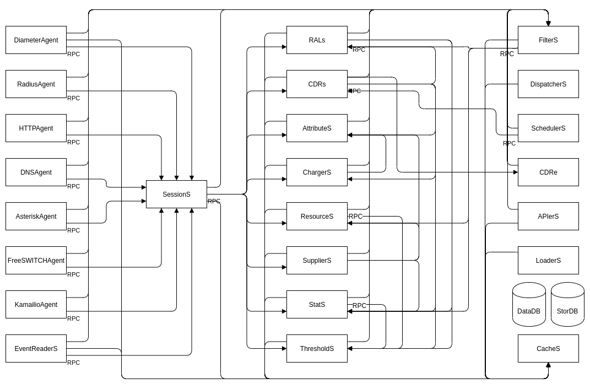

.. _cgr-engine:

cgr-engine
==========

Groups most of functionality from services and components.

Customisable through the use of *json* :ref:`JSON configuration <configuration>` or command line arguments (higher prio).

Able to read the configuration from either a local directory  of *.json* files with an unlimited number of subfolders (ordered alphabetically) or a list of http paths (separated by ";").

::

 $ cgr-engine -help
 Usage of cgr-engine:
  -config_path string
        Configuration directory path (default "/etc/cgrates/")
  -cpuprof_dir string
        Directory for CPU profiles
  -log_level int
        Log level (0=emergency to 7=debug) (default -1)
  -logger string
        Logger type <*syslog|*stdout>
  -memprof_dir string
        Directory for memory profiles
  -memprof_interval duration
        Interval between memory profile saves (default 15s)
  -memprof_maxfiles int
        Number of memory profiles to keep (most recent) (default 1)
  -memprof_timestamp
        Add timestamp to memory profile files
  -node_id string
        Node ID of the engine
  -pid string
        Path to write the PID file
  -preload string
        Loader IDs used to load data before engine starts
  -print_config
        Print configuration object in JSON format
  -scheduled_shutdown duration
        Shutdown the engine after the specified duration
  -set_versions
        Overwrite database versions (equivalent to cgr-migrator -exec=*set_versions)
  -singlecpu
        Run on a single CPU core
  -version
        Print application version and exit

.. hint:: $ cgr-engine -config_path=/etc/cgrates

   Internal Architecture of **cgr-engine**

The components from the diagram can be found documented in the links bellow:

.. toctree::
   :maxdepth: 1

   agents
   sessions
   rals
   cdrs
   ees
   attributes
   chargers
   resources
   routes
   stats
   trends
   thresholds
   filters
   dispatchers
   schedulers
   apiers
   loaders
   caches
   datadb
   stordb
   rpcconns
   
