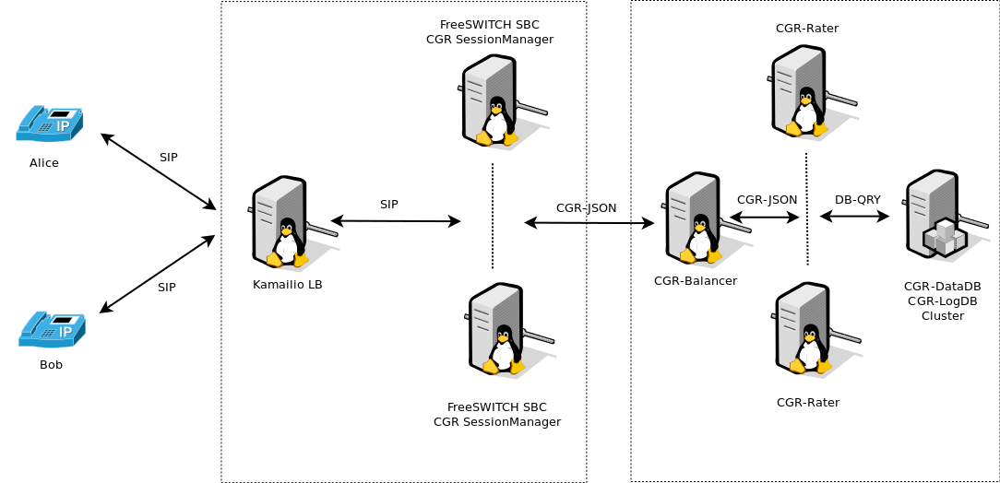

8.1. FreeSWITCH integration
================================
Being the original platform supported by CGRateS, FreeSWITCH_ has the advantage of support for complete set of CGRateS features.
When used as Telecom Switch it fully supports all rating modes: **prepaid**/**postpaid**/**pseudoprepaid**/**rated**.
A typical use case would be like the one in the diagram below:

The process of rating is decoupled into two different components:

8.1.1. SessionManager
---------------------

**TODO** - update and add CDRs and CDRc.

- Attached to FreeSWITCH_ via the socket library, enhancing CGRateS with real-time call monitoring and call control functions.
- In Prepaid mode implements the following behaviour:
   - On *CHANNEL_PARK* event received from FreeSWITCH_: 
      - Authorize the call by calling *GetMaxSessionTime* on the Rater.
      - Sets the channel variable *cgr_notify* via *uuid_setvar* to one of the following values:
         - MISSING_PARAMETER: if one of the required channel variables is missing and CGRateS cannot make rating.
         - SYSTEM_ERROR: if rating could not be performed due to a system error.
         - INSUFFICIENT_FUNDS: if MaximSessionTime is 0.
         - AUTH_OK: Call is authorized to proceed. 
      - Un-Park the call via *uuid_transfer* to original dialed number. The FreeSWITCH_ administrator is expected to make use of *cgr_notify* variable value to either allow the call going further or reject it (eg: towards an IVR or returning authorization fail message to call originator).

   - On *CHANNEL_ANSWER* event received:
      - Index the call into CGRateS's cache.
      - Starts debit loop by calling at configured interval *MaxDebit* on the Rater.
      - If any of the debits fail:
          - Set *cgr_notify* channel variable to either SYSTEM_ERROR in case of errors or INSUFFICIENT_FUNDS of there would be not enough balance for the next debit to proceed.
          - Send *hangup* command with cause *MANAGER_REQUEST*.

    - On *CHANNEL_HANGUP_COMPLETE* event received:
       - Refund the reserved balance back to the user's account (works for both monetary and minutes debited).
       - Save call costs into CGRateS LogDB.

- In Postpaid mode:

   - On *CHANNEL_ANSWER* event received:
       - Index the call into CGRateS's cache.

   - On *CHANNEL_HANGUP_COMPLETE* event received:
       - Call *Debit* RPC method on the Rater.
       - Save call costs into CGRateS LogDB.

- On CGRateS Shutdown execute, for security reasons, hangup commands on calls which can be CGR related:
   - *hupall MANAGER_REQUEST cgr_reqtype prepaid*
   - *hupall MANAGER_REQUEST cgr_reqtype postpaid* 

8.1.2. Mediator
---------------

**TODO** - remove this section. Mediator functionality is handled by CDRs and CDRc.

Attaches costs to FreeSWITCH_ native written .csv files. Since writing channel variables during hangup is asynchronous and can be missed by the CDR recorder mechanism of FreeSWITCH_, we decided to keep this as separate process after the call is completed and do not write the costs via channel variables.

8.1.2.1. Modes of operation
~~~~~~~~~~~~~~~~~~~~~~~~~~~

The Mediator process for FreeSWITCH works in two different modes:

- Costs from LogDB (activated by setting -1 as *subject_idx* in the *cgrates.cfg*:
   - Queries LogDB for a previous saved price by SessionManager.
   - This behavior is typical for prepaid/postpaid calls which were previously processed by SessionManager and important in the sense that we write in CDRs exactly what was billed real-time from user's account.
- Costs queried from Rater:
   - This mode is specific for multiple process mediation and does not necessary reflect the price which was deducted from the user's account during real-time rating.
   - Another application for this mode is pseudoprepaid when there is no SessionManager monitoring and charging calls in real-time (debit done directly from CDRs).
   - This mode is triggered from configuration file by setting proper indexes (or leave them defaults if cgrates rating template is using whitin FreeSWITCH_ cdr_csv configuration file.

A typical usage into our implementations is a combination between the two modes of operation (by setting at a minimum -1 as subject_idx to run from LogDB and succesive mediation processes with different indexes).

8.1.2.2. Implementation logic
~~~~~~~~~~~~~~~~~~~~~~~~~~~~~

- The Mediator process is configured and started in the *cgrates.cfg* file and is alive as long as the *cgr-engine* application is on.
- To avoid concurrency issues, the Mediator does not process active maintained CDR csv files by FreeSWITCH_ but picks them up as soon as FreeSWITCH_ has done with them by rotating. The information about rotation comes in real-time on the Linux OS through the use of inotify.
- Based on configured indexes in the configuration file, the Mediator will start multiple processes for the same CDR.
- For each mediation process configured the Mediator will apped the original CDR with costs calculated. In case of errors of some kind, the value *-1* will be prepended.
- When mediation is completed on a file, the file will be moved to configured *cdr_out_dir* path.

.. _FreeSWITCH: http://www.freeswitch.org

