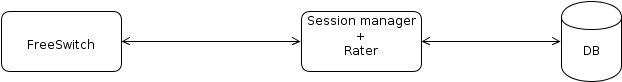
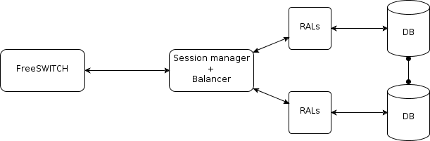
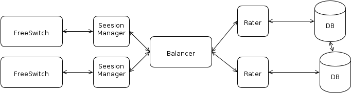

1.Introduction
==============
CGRateS is a very fast and easy scalable rating engine targeted especially for ISPs and Telecom Operators.

It is written in Go (http://golang.org) and accessible from any language via JSON RPC. The code is well documented (go doc compliant API docs) and heavily tested.

After testing various databases like Kyoto_ cabinet, Redis_ or Mongodb_, the project focused on Redis as it delivers the best trade-off between speed, configuration and scalability. Despite that a connection to any database can be easily integrated by writing a simple adapter.

.. _kyoto: http://fallabs.com/kyotocabinet
.. _Redis: http://redis.io
.. _Mongodb: http://www.mongodb.org

To better understand the CGRateS architecture, bellow are some of the configurations in which CGRateS can operate:

This scenario fits most of the simple installations. The Balancer can be left out and the Rater can be queried directly.

While the network grows more Raters can be thrown into the stack to offer more requests per seconds workload. This implies the usage of the Balancer to distribute the requests to the Raters running on the different machines.

Of course more SessionManagers can serve multiple Telecom Switches and all of them are connected to the same Balancer. We are planning to support multiple Balancers for huge networks if the need arises.

1.1. CGRateS Features
---------------------
- Reliable and Fast ( very fast ;) ). To get an idea about speed, we have benchmarked 11000+ req/sec on a rather modest machine without requiring special tweaks in the kernel.
   - Using most modern programming concepts like multiprocessor support, asynchronous code execution within microthreads.
   - Built-in data caching system per call duration.
   - In-Memory database with persistence over restarts.
   - Use of Balancer assures High-Availability of Raters as well as increase of processing performance where that is required.
   - Use of Linux enterprise ready tools to assure High-Availability of the Balancer where that is required (*Supervise* for Application level availability and *LinuxHA* for Host level availability).
- Modular architecture
    - Easy to enhance functionality by rewriting custom session managers or mediators.
    - Flexible API accessible via both Gob (Golang specific, increased performance) or JSON (platform independent, universally accesible).
- Prepaid, Postpaid and Pseudo-Prepaid Controller.
    - Mutiple Primary Balances per Account (eg: MONETARY, SMS, INTERNET_MINUTES, INTERNET_TRAFFIC).
    - Multiple Auxiliary Balances per Account (eg: Free Minutes per Destination,  Volume Rates, Volume Discounts).
    - Concurrent sessions per account sharing the same balance with configurable debit interval (starting with 1 second).
    - Built-in Task-Scheduler supporting both one-time as well as recurrent actions (eg: TOPUP_MINUTES_PER_DESTINATION, DEBIT_MONETARY, RESET_BALANCE).
    - ActionTriggers ( useful for commercial offerings like receive amounts of monetary units if a specified number of minutes was charged in a month).
- Highly configurable Rating.
    - Connect Fees.
    - Priced Units definition.
    - Rate increments.
    - Millisecond timestaps.
    - Four decimal currencies.
    - Multiple TypeOfRecord rating (eg: standard vs. premium calls, SMSes, Internet Traffic).
    - Rating subject concatenations for combined records (eg: location based rating for same user).
    - Recurrent rates definition (per year, month, day, dayOfWeek, time).
    - Rating Profiles activation times (eg: rates becoming active at specific time in future).
- Multi-Tenant for both Prepaid as well as Rating.
- Flexible Mediator able to run multiple mediation processes on the same CDR.
- Verbose action logging in persistent databases (eg: Postgres) to cope with country specific law requirements.
- Good documentation ( that's me :).
- "Free as in Beer" with commercial support available on-demand.

1.2. How does CGRateS work?
---------------------------
Let's start with the most important function: finding the cost of a certain call. 

The call information comes to CGRateS having the following information: subject, destination, start time and end time. The engine will lookup the database for the activation periods applicable to the received subject and destination. 

What are the activation periods?

    The activation period is a structure describing different prices for a call on different intervals of time. This structure has an activation time, which enables the complete on the activation period at some point in time and one ore more (usually more than one) intervals with prices. 

::
	Interval {
		Months 
		MonthDays
		WeekDays
		StartTime, EndTime
		Weight, ConnectFee, Price, BillingUnit
	}

An **Interval** specifies the Month, the MonthDay, the WeekDays and the StartTime and the EndTime when the Interval's price profile is in effect. 

:Example: The Interval {"Month": [1], "WeekDays":[1,2,3,4,5], "StartTime":"18:00:00", "Price":0.1, "BillingUnit": 1} specifies that the Price for the first month of each year from Monday to Friday starting 18:00 is 0.1 cents per second. Most structure elements are optional and they can be combined in any way it makes sense. If an element is omitted it means it is zero ore any.

The *ConnectFee* specifies the connection price for the call if this interval is the first one from the call.

The *Weight* will establish which interval will set the price for a call segment if more then one applies to it. 

:Example: Let's assume there is an interval defining price for the weekdays and another interval that defines a special holiday prices. As that holiday is also one of the regular weekdays than both intervals are applicable to a call made on that day so the interval with the smaller Weight will give the price for the call in question. If both intervals have the same Weight than the interval with the smaller price wins. It is, however, a good practice to set the Weight for the defined intervals.

So when there is a need to define new sets of prices just define new ActivationPeriods with the StartTime set to the moment when they become active.

Let's get back to the engine. After it finds the applicable ActivationPeriod(s) it will split the call duration in multiple time-spans attaching the appropriate ActivationPeriod and Interval to each them. The final price will be the sum of the prices of these times spans plus the ConnectionFee from the first time-span of the call.

The other functions relay on a user budget structure to manage the different quotas for postpaid and prepaid clients. The UserBudget keeps track of user monetary balance, free SMS and minutes for every destination, Internet traffic and offers the volume discount and received call bonus. 

Let's take them one by one.

CGRateS provide api for adding/substracting user's money credit. The prepaid and postpaid are uniformly treated except that the prepaid is checked to be always greater than zero and the postpaid can go bellow zero.

Both prepaid and postpaid can have a limited number of free SMS and Internet traffic per month and this budget is replenished at regular intervals based on the user tariff plan or as the user buys more free SMS (for example).

The free (or special price) minutes must be handled a little differently because usually they are grouped by specific destinations (e.g. national minutes, ore minutes in the same network). So they are grouped in buckets and when a call is made the engine checks all applicable buckets to consume minutes according to that call.

Another special feature allows user to get a better price as the call volume increases each month. This can be added on one ore more thresholds so the more he/she talks the cheaper the calls.

Finally bonuses can be rewarded to users who received a certain volume of calls.

