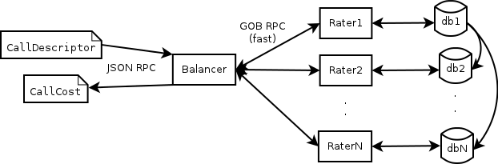

Tutorial
========
The general usage of the CGRateS involves creating a CallDescriptor structure sending it to the balancer via JSON RPC and getting a response from the balancer inf form of a CallCost structure or a numeric value for requested information.

The general steps to get up and running with CGRateS are:

#. Create JSON files containing rates, budgets, tariff plans and destinations, see :ref:`data-importing`.
#. Load the data in the databases using the loader tool.
#. Start the balancer, see :ref:`running`.
#. Start one ore more raters.
#. Make API calls to the balancer/rater.

If the network does not require more than one rater to handle the calls. The balancer can be left out and the rater can be queried directly. In this case the rater must be started with --json=true option to instruct the application to offer the JSON-RPC interface.

CallDescriptor structure
------------------------
	- TOR                                int
	- CstmId, Subject, DestinationPrefix string
	- TimeStart, TimeEnd                 time.Time
	- Amount                             float64
TOR
	Type Of Record, used to differentiate between various type of records
CstmId
	Customer Identification used for multi tenant databases
Subject
	Subject for this query
DestinationPrefix
	Destination prefix to be matched
TimeStart, TimeEnd
	The start end end of the call in question
Amount
	The amount requested in various API calls (e.g. DebitSMS amount)

CallCost structure
------------------
	- TOR                                int
	- CstmId, Subject, DestinationPrefix string
	- Cost, ConnectFee                   float64
	- Timespans                          []*TimeSpan
TOR
	Type Of Record, used to differentiate between various type of records (for query identification and confirmation)
CstmId
	Customer Identification used for multi tenant databases (for query identification and confirmation)
Subject
	Subject for this query (for query identification and confirmation)
DestinationPrefix
	Destination prefix to be matched (for query identification and confirmation)
Cost
	The requested cost
ConnectFee
	The requested connection cost
Timespans
	The timespans in witch the initial TimeStart-TimeEnd was split in for cost determination with all pricing and cost information attached. 

Instalation
-----------
**Using packages**
**Using source**

After the go environment is installed_ and setup_ just issue the following commands:
::

	go get github.com/rif/cgrates/cmd/cgr-rater
	go get github.com/rif/cgrates/cmd/cgr-balancer
	go get github.com/rif/cgrates/cmd/cgr-loader
	go get github.com/rif/cgrates/cmd/cgr-console
	
After that navigate

.. _installed: http://golang.org/doc/install
.. _setup: http://golang.org/doc/code.html

Running
-------

There are only three main command to used with CGRateS:

cgr-balancer
	The cgr-balancer will open a JSON RPC server and an HTTP server ready for taking external requests. It will also open a rater server on witch the raters will register themselves when they start.
::

	rif@grace:~$ cgr-balancer --help
	Usage of balancer:
  		-httpapiaddr="127.0.0.1:8000": HTTP API server address (localhost:2002)
  		-jsonrpcaddr="127.0.0.1:2001": JSON RPC server address (localhost:2001)
  		-rateraddr="127.0.0.1:2000": Rater server address (localhost:2000)

cgr-rater
	The cgr-rater can be provided with the balancer server address and can be configured to listen to a specific interface and port.
::
	
	rif@grace:~$ cgr-rater --help
	Usage of rater:
	  -balancer="127.0.0.1:2000": balancer address host:port
	  -json=false: use json for rpc encoding
	  -listen="127.0.0.1:1234": listening address host:port

cgr-console
	The cgr-console is a command line tool used to access the balancer (or the rater directly) to call all the API methods offered by CGRateS.
::
	
	rif@grace:~$ cgr-console --help
	Usage of cgr-console:
	  -amount=100: Amount for different operations
	  -balancer="127.0.0.1:2001": balancer address host:port
	  -cstmid="vdf": Customer identification
	  -dest="0256": Destination prefix
	  -subject="rif": The client who made the call
	  -te="2012-02-09T00:10:00Z": Time end
	  -tor=0: Type of record
	  -ts="2012-02-09T00:00:00Z": Time start

	rif@grace:~$ cgr-cgrates 
	List of commands:
		getcost
		getmaxsessiontime
		debitbalance
		debitsms
		debitseconds
		addvolumediscountseconds
		resetvolumediscountseconds
		addrecievedcallseconds
		resetuserbudget
		status

cgr-loader
	The loader is the most configurable tool because it has options for each of the three supported databases (kyoto, redis and mongodb).
	Apart from that multi-database options it is quite easy to be used.
	The apfile, destfile, tpfile and ubfile parameters are for specifying the input json files.
	The storage parameter specifies the database to be used and then the databases access information (host:port or file) has to be provided.

	:Example: cgr-loader -storage=kyoto -kyotofile=storage.kch -apfile=activationperiods.json -destfile=destinations.json -tpfile=tariffplans.json -ubfile=userbudgets.json
::

	rif@grace:~$ cgr-loader --help
	Usage of cgr-loader:
	  -apfile="ap.json": Activation Periods containing intervals file
	  -destfile="dest.json": Destinations file
	  -kyotofile="storage.kch": kyoto storage file (storage.kch)
	  -mdb="test": mongo database name (test)
	  -mongoserver="127.0.0.1:27017": mongo server address (127.0.0.1:27017)
	  -pass="": redis database password
	  -rdb=10: redis database number (10)
	  -redisserver="tcp:127.0.0.1:6379": redis server address (tcp:127.0.0.1:6379)
	  -storage="all": kyoto|redis|mongo
	  -tpfile="tp.json": Tariff plans file
	  -ubfile="ub.json": User budgets file

.. _data-importing:

Data importing
--------------
**Activation periods**
::
	{"TOR": 0,"CstmId":"vdf","Subject":"rif","DestinationPrefix":"0257", "ActivationPeriods": [
	        {"ActivationTime": "2012-01-01T00:00:00Z", "Intervals": [
	                {"BillingUnit":1,"ConnectFee":0,"Month":0,"MonthDay":0,"Ponder":0,"Price":0.1,
	                	"StartTime":"18:00:00","EndTime":"","WeekDays":[1,2,3,4,5]},
	                {"BillingUnit":1,"ConnectFee":0,"Month":0,"MonthDay":0,"Ponder":0,"Price":0.2,
	                	"StartTime":"","EndTime":"18:00:00","WeekDays":[1,2,3,4,5]}, 
	                {"BillingUnit":1,"ConnectFee":0,"Month":0,"MonthDay":0,"Ponder":0,"Price":0.1,
	                	"StartTime":"","EndTime":"","WeekDays":[6,0]}
	            ]
	        },
	        {"ActivationTime": "2012-02-08T00:00:00Z", "Intervals": [
	                {"BillingUnit":60,"ConnectFee":0,"Month":0,"MonthDay":0,"Ponder":0,"Price":10,
	                	"StartTime":"","EndTime":"18:00:00","WeekDays":[1,2,3,4,5]}, 
	                {"BillingUnit":60,"ConnectFee":0,"Month":0,"MonthDay":0,"Ponder":0,"Price":1,
	                	"StartTime":"18:00:00","EndTime":"","WeekDays":[1,2,3,4,5]},
	                {"BillingUnit":60,"ConnectFee":0,"Month":0,"MonthDay":0,"Ponder":0,"Price":1,
	                	"StartTime":"","EndTime":"","WeekDays":[6,0]}
	            ]
	        }
	    ]
	}

The above snippet describes prices for subject "rif" and destination "0257". There are two activation periods, the first one is active starting 2012-01-01 and the second one starting from 2012-02-08. Each define multiple intervals with different prices for various time periods.

Parameters:

TOR
	Type Of Service. For future extensions.
CstmId
	Customer Id. Used for multi tenant databases.
Subject
	The code that uniquely identifies a user.
DestinationPrefix
	The destination network number. For speed reasons we are not using here the below described destinations. We are trading memory space for speed.
ActivationPeriods
	A list of one ore more price descriptive periods. These periods must be contiguous and non overlapping.
ActivationTime
	The time when current period becomes active.
Intervals
	A list of price intervals intervals
Month
	The month for this interval. Zero value means all months.
MonthDay
	The day of the month for this interval. Zero value means all month days.
WeekDays
	A list with the days of the week for this interval. An empty list means all week days.
StartTime, EndTime
	The start and end hours in a day for this interval. Zero value means from/to start/end of the day.
Ponder
	Used to set the priority of the interval in relation with other applicable intervals.
ConnectFee
	The connection price for this interval.
Price
	The unit price for this interval.
BillingUnit
	The billing unit for this interval (in seconds). Value can be below one up to nanoseconds.

**Destinations**
::
	{"Id":"nationale", "Prefixes":["0256","0257","0723","0740"]},
	{"Id":"retea", "Prefixes":["0723","0724"]},
	{"Id":"mobil", "Prefixes":["0723","0740"]},
	{"Id":"radu", "Prefixes":["0723045326"]}

Destinations are list of prefixes that together define a destination. These destinations are used for definition of minute buckets.

Parameters:

Id
	The Id of this destination. Can be anything (letters and/or numbers).
Prefixes
	List with destination's prefixes. A prefix can appear in more than one destination.

**Tariff plans**
::
	{"Id":"dimineata","SmsCredit":100,"ReceivedCallsSecondsLimit": 100,
			"RecivedCallBonus" : {"Credit": 100},
			"MinuteBuckets":
				[{"Seconds":100,"Priority":10,"Price":0.01,"DestinationId":"nationale"},
					{"Seconds":1000,"Priority":20,"Price":0,"DestinationId":"retea"}],
			"VolumeDiscountThresholds":
				[{"Volume": 100, "Discount": 10},
					{"Volume": 500, "Discount": 15},
					{"Volume": 1000, "Discount": 20}]			
	}

Tariff plans define the free quotas for network users. These amount are refilling the user budgets at specified intervals.

Parameters:

Id
	An Id for this tariff plan. Can be anything (letters and/or numbers).
SmsCredit
	The available free number of SMS.
Traffic
	The available free amount of traffic.
ReceivedCallSecondsLimit
	The threshold for receiving the incoming call volume bonus. When the user will receive this amount of incoming call seconds he/she will get the below described bonus.
RecivedCallBonus
	The bonus that will be awarded when the incoming calls amount of seconds is reached. It can be one ore more of the following entities: Credit, SmsCredit, Traffic, MinuteBucket (an amount of free / cheaper seconds to a specific destination). 
MinuteBuckets
	A list of available special minutes for specific destinations. Each bucket can specify the available number of Seconds for a specific destination. It can also specify a priority Priority to establish the order of the bucket usage and a Price if he minutes are not free (but cheaper). 
VolumeDiscountThresholds
	A list threshold for placed calls volume discounts. Each threshold specifies a Volume and a Discount discount percentage.

**User budgets**
::
	{"Id":"broker","Credit":0,"SmsCredit":0,"Traffic":0,"VolumeDiscountSeconds":0,
		"ReceivedCallSeconds":0,"ResetDayOfTheMonth":10,"TariffPlanId":"seara","MinuteBuckets":
	    	[{"Seconds":10,"Priority":10,"Price":0.01,"DestinationId":"nationale"},
		 		{"Seconds":100,"Priority":20,"Price":0,"DestinationId":"retea"}]
	}

User budget describes the amount of various free quotas for every client of the network. It contains the entities from the tariff plan plus more items to track user status.

Parameters:

Id
	The Id uniquely identifies the client.
Credit
	The amount of the available credit for prepaid or the total cost for postpaid.
SmsCredit
	The number of available free SMS.
Traffic
	The amount of available free Internet traffic.
VolumeDiscountSeconds
	The accumulated number of placed call seconds to be used for volume discounts.
ReceivedCallSeconds
	The accumulated amount of received call seconds to be used for received call bonus.
ResetDayOfTheMonth
	The day of the month when the free quotas will be refiled.
TariffPlanId
	The Id of the client's tariff plan. This is used to refill the free quotas 
MinuteBuckets
	A list of buckets containing the available seconds to various destinations.

Database selection
-------------------

**Kyoto cabinet**

Pros:
	- super fast (the in memory data is accessed directly by the rater processes)
	- easy backup
Cons:
	- harder to synchronize different raters	

**Redis**

Pros:
	- easy configuration
	- easy master-server configuration	
Cons:
	- slower than kyoto
	- less features than mongodb

**MongoDB**

Pros:
	- most features
	- most advanced clustering options
Cons:
	- slowest of the three
